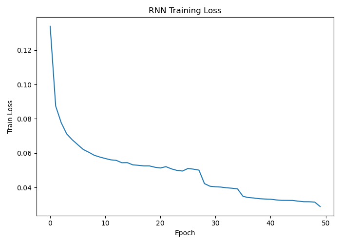
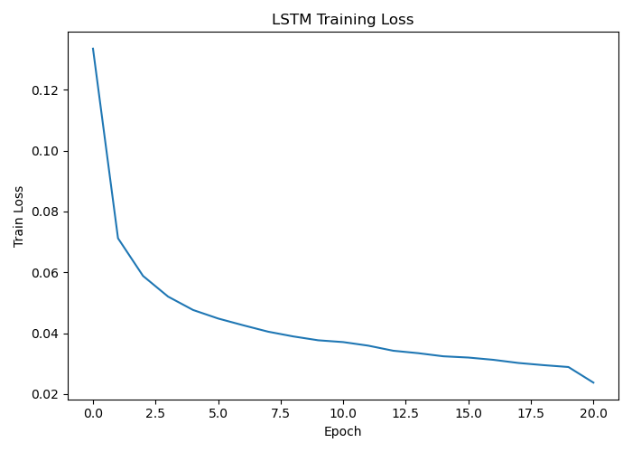
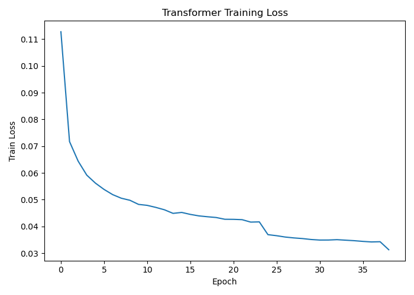
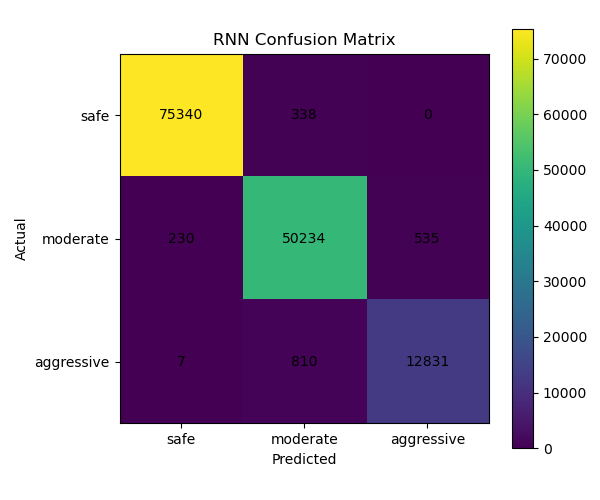
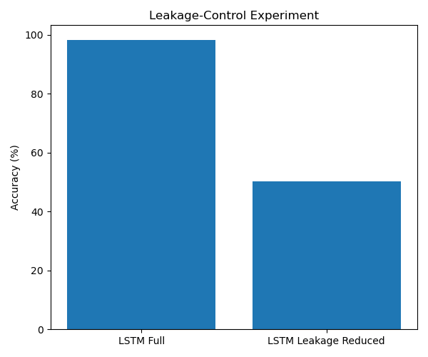

# Multimodal Driver Behaviour Classification

> **RNN · LSTM · Transformer** — 3-class driver behaviour classification from 16.3 million trajectory observations merged with weather, air quality, and traffic signal data.

[](https://www.python.org/)
[](https://pytorch.org/)
[](https://zenodo.org/records/11396372)
[](LICENSE)

---

## Overview

This project implements and compares three sequential deep learning architectures for classifying urban driver behaviour as **safe**, **moderate**, or **aggressive** from a 1.5-second sliding window of 13 multimodal sensor features.

The dataset is the **DLR Urban Traffic Dataset v1.0.0** — a full 24-hour recording from a signalised intersection in Braunschweig, Germany (24 September 2023), providing four synchronised sensor modalities at different sampling rates.

---

## Results

| Model | Accuracy | Macro F1 | Inference Latency |
|---|---|---|---|
| Majority Class Baseline | 51.63% | 35.16% | — |
| Logistic Regression | 93.12% | 93.17% | — |
| **RNN** | **98.59%** | **97.60%** | 0.07 ms/batch |
| **LSTM** | **98.44%** | **97.21%** | 0.10 ms/batch |
| **Transformer** | **98.37%** | **97.17%** | 0.35 ms/batch |
| LSTM Leakage-Reduced | 49.31% | 31.04% | — |

All three deep learning models achieved zero safe→aggressive misclassifications on the held-out test set.

### Loss Curves

| RNN | LSTM | Transformer |
|---|---|---|
|  |  |  |

### Confusion Matrices

| RNN | LSTM | Transformer |
|---|---|---|
|  |  |  |

### Leakage Control



---

## Dataset

**DLR Urban Traffic Dataset v1.0.0**
DOI: [10.5281/zenodo.11396372](https://doi.org/10.5281/zenodo.11396372) · License: CC BY-NC-SA 4.0

| Modality | Rows | Rate | Key Features |
|---|---|---|---|
| Trajectories | 16,324,056 | 20 Hz | position, velocity, acceleration, yaw, vehicle type |
| Weather | 8,640 | 10–60 s | temperature, humidity, wind speed, rain, visibility |
| Air Quality | 1,440 | 60 s | NO₂, CO, SO₂, O₃, PM2.5, PM10 |
| Traffic Lights | 2,585,610 | 1 Hz | signal phase state (DLR Table 3 encoding) |

Download all four modalities from Zenodo and place them under `data/` as described in [Setup](#setup).

---

## Model Architectures

All three models share the same depth (2 layers), hidden size (64), dropout (0.2), FC head (64 → 32 → 3), loss function, and optimiser. Differences are architectural only.

**RNNClassifier** — 2-layer Vanilla RNN. ~45K parameters. Lowest latency (0.07 ms). Best for real-time edge deployment.

**LSTMClassifier** — 2-layer LSTM with gating mechanism. ~70K parameters. Retains driving context across the 1.5-second window. Best for sustained behaviour detection.

**TransformerClassifier** — 2-layer encoder, 4 attention heads, learnable positional embedding. ~110K parameters. Best suited for longer sequences and multi-intersection fusion.

---

## Project Structure

```
.
├── loader.py                  # Load and merge all four dataset modalities
├── feature_engineering.py     # Labelling, stratified sampling, sequence building
├── trainer.py                 # RNN, LSTM, Transformer definitions and training loop
├── baseline.py                # Majority class and Logistic Regression baselines
├── ablation.py                # Feature ablation study (trajectory → all features)
├── baseline_results.json      # Saved baseline evaluation results
├── ablation_results.json      # Saved ablation study results
├── RNN_loss_curve.png
├── RNN_confusion_matrix.png
├── LSTM_loss_curve.png
├── LSTM_confusion_matrix.png
├── LSTM_LeakageReduced_loss_curve.png
├── LSTM_LeakageReduced_confusion_matrix.png
├── Transformer_loss_curve.png
├── Transformer_confusion_matrix.png
├── leakage_control_comparison.png
├── requirements.txt
└── README.md
```

---

## Setup

### 1. Clone the repository

```bash
git clone https://github.com/nydia-takhel/Multimodal-Driver-Behaviour-Classification.git
cd Multimodal-Driver-Behaviour-Classification
```

### 2. Install dependencies

```bash
pip install -r requirements.txt
```

Python 3.9 or higher is required.

### 3. Download the dataset

Download the DLR Urban Traffic Dataset from [Zenodo](https://zenodo.org/records/11396372) and organise it as follows:

```
data/
├── trajectories/     # 96 CSV files
├── weather/          # 96 CSV files
├── air_quality/      # 96 CSV files
└── traffic_lights/   # 96 CSV files
```

Update the `DATA_ROOT` path in `loader.py` to point to your `data/` directory.

---

## Reproducing Results

Run the scripts in order:

```bash
# 1. Load and merge all four modalities (produces merged DataFrame)
python loader.py

# 2. Label behaviour, sample vehicles, build sequences
python feature_engineering.py

# 3. Train RNN, LSTM, and Transformer
python trainer.py

# 4. Evaluate baselines (Majority Class + Logistic Regression)
python baseline.py

# 5. Run feature ablation study
python ablation.py
```

Each script saves its outputs (model weights, result JSONs, plots) to the working directory.

---

## Methodology

### Behaviour Labelling

Labels are assigned per-observation using rule-based kinematic thresholds:

| Class | Condition | Source |
|---|---|---|
| **Aggressive** | accel > 2.0 m/s² OR speed > 14.0 m/s OR yaw_change > 15°/step | Bellem et al. (2016); StVO §3 |
| **Safe** | accel < 0.5 m/s² AND speed < 8.0 m/s AND yaw_change < 5°/step | Conservative urban threshold |
| **Moderate** | All other observations | — |

### Pipeline

- All four dataset modalities merged using `pd.merge_asof()` with nearest-timestamp tolerances
- Vehicle-level stratified sampling (500 vehicles per dominant class, 1,500 total)
- Vehicle-level 80/20 train/test split — no vehicle appears in both sets
- StandardScaler fitted on training vehicles only
- Sliding window sequences: 30 timesteps (1.5 s at 20 Hz), 13 features, target 10 steps (500 ms) ahead

### Training

- Optimiser: Adam (lr=1e-3, weight_decay=1e-5)
- Scheduler: ReduceLROnPlateau on validation loss (patience=5, factor=0.5)
- Early stopping: patience=7 on validation loss
- Gradient clipping: max norm=1.0

### Leakage Control

An LSTM retrained without the three kinematic features (velocity, acceleration, yaw) used to construct the labels dropped from 98.44% to 49.31% accuracy — confirming that predictive signal originates from the labelling variables, not spurious environmental correlations.

---

## Feature Ablation

| Condition | Accuracy | F1-Aggressive |
|---|---|---|
| Trajectory only (3 features) | 98.85% | 95.69% |
| + Time encoding (5 features) | 98.82% | 95.62% |
| + Weather (10 features) | 98.52% | 94.65% |
| All features (13 features) | 98.32% | 93.92% |

Trajectory features dominate for rule-defined labels. Multi-modal fusion is architecturally sound and expected to add value with independently annotated labels.

---

## References

1. DLR Institute of Transportation Systems. (2024). *DLR Urban Traffic Dataset v1.0.0*. Zenodo. DOI: 10.5281/zenodo.11396372.
2. Bellem, H. et al. (2016). Objective metrics of comfort in automotive vehicles. *Transportation Research Part F*, 41, 182–196.
3. Hochreiter, S. & Schmidhuber, J. (1997). Long Short-Term Memory. *Neural Computation*, 9(8), 1735–1780.
4. Vaswani, A. et al. (2017). Attention Is All You Need. *NeurIPS*, 30.

---

## License

This project is licensed under the MIT License — see [LICENSE](LICENSE) for details.

The DLR Urban Traffic Dataset is licensed under [CC BY-NC-SA 4.0](https://creativecommons.org/licenses/by-nc/4.0/) and is not included in this repository. Download it directly from [Zenodo](https://zenodo.org/records/11396372).
